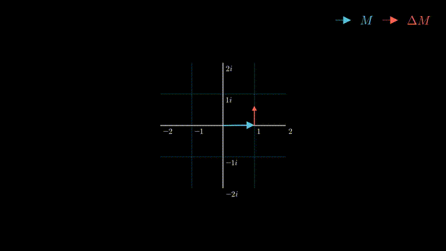
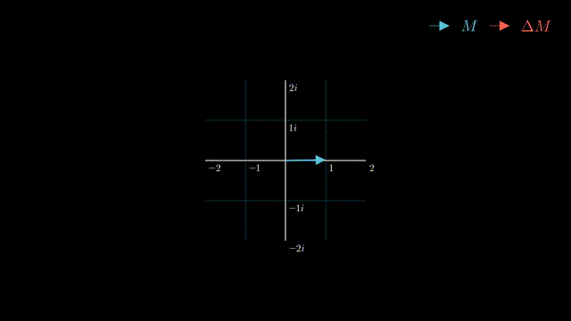

# Complex exponent simulation

## Description
This project visualizes the connection between compound interest and the complex exponential function. By interpreting an imaginary interest rate as continuous compounding, the simulation demonstrates how increasing the compounding frequency causes the initial ‘investment vector’ to rotate around the unit circle. Inspired by Grant Sanderson’s video on [imaginary interest rates](https://www.youtube.com/watch?v=IAEASE5GjdI), wanted to make this abstract mathematical idea visually intuitive.

## Some formulas
Given an initial deposit $M_0$, which grows according to the compound interest rule, the amount of money after $n$ compounding intervals is:
$$M_n = M_0\left(1 + \frac{rT}{n}\right)^{n},$$

where  
$M_n$ — accumulated wealth after time $T$  
$M_0$ — initial deposit  
$r$ — interest rate ($\sqrt{-1}$ in our case)  
$T$ — accumulation period  
$n$ — number of compounding intervals

A slighly different way to look at the change of $M$ on every step is to represent it as a vector on the complex plane with the following update rule: 

$$\vec{M_i} = \vec{M}_{i-1} + \underbrace{j\cdot \frac{T}{n}\cdot \vec{M}_{i-1}}_{\Delta\vec{M}_{i-1}} = \vec{M}_{i - 1} + \Delta\vec{M}_{i-1} \quad \text{for } i = 1, \dots, n$$

where  
$\vec{M}_i$ — the position of the $\vec{M}$ vector at the $i$-th step  
$\Delta\vec{M}_{i}$ — a change in the position of the $\vec{M}$ vector at the $i$-th step  

In this model, the next position of the vector $\vec{M}$ is obtained by adding the current vector $\vec{M}$ to a version of itself that has been scaled and rotated 90° clockwise. By simulating this for different values of $n$, a circular movement pattern is obtained for every case. The radius of the circle at an every step is given by:

$$R_i  = R_{i - 1}\cdot \sqrt{1^2 + \left(\frac {T}{n}\right)^2 }$$

while the rotation angle is:

$$\theta = \frac{T}{n}$$

As $n$ goes to infinity, the vector $\vec{M}$ moves according to the trajectory of an ideal circle, because the radius doesn't blow up, while the rotation angle approaches the $\arctan\left(\frac{T}{n}\right)$. 

## Simulations

### $n = 10$

### $n = 50$

### $n = 1000$
